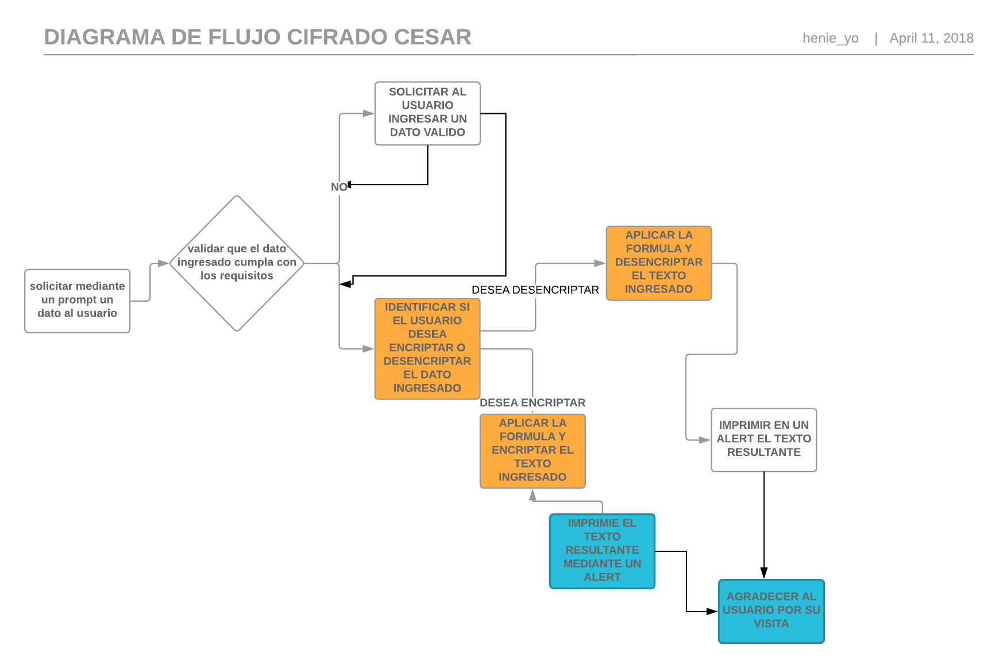

# Cifrado Cesar
#### Requerimientos
##### El programa debe ser capaz de cifrar y descifrar tanto letras mayúsculas como minúsculas.
##### La fórmula para descifrar es: (x + n) % 26
##### La formula para cifrar es : (x-65 + n)%26 +65
##### El código debe estar compuesto por 2 funciones con los siguientes nombres: cipher y decipher
##### El usuario no debe poder ingresar un campo vacío o que contenga números
#### Descripcion

##### Se crea una web que pida, por medio de un prompt(), una frase al usuario y devuelva el mismo mensaje encriptado según el algoritmo de Cifrado César con el parámetro de desplazamiento de 33 espacios hacia la derecha
#### Por ejemplo:
###### Texto original: ABCDEFGHIJKLMNOPQRSTUVWXYZ
###### Texto codificado: HIJKLMNOPQRSTUVWXYZABCDEFG

Nota : para poder resolver el problema se utilizara lo siguiente
1. charCodeAt(); te da la letra en codigo ASCII
2. string.fromCharCode(); te devuelve la letra desde ASCII

## * Pseudocodigo *
1. Mediante un prompt solicitar al usuario ingresar un dato valido para cifraro descifrar.
2. Validar que el dato ingressado cumpla con los requisitos (no contener numeros o caracteres extraños y no estar vacio)
3. si el usuario desea encriptar el texto convertir el dato ingresado utilizando el cifrado Cesar.
4. Retornar el texto resultante del paso anterior.

